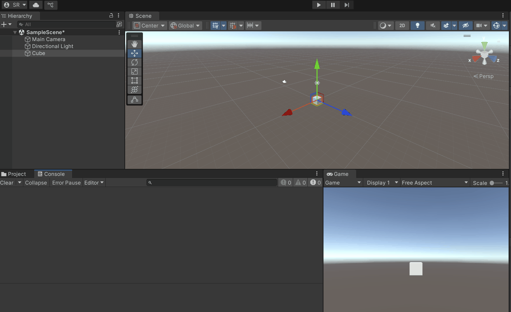
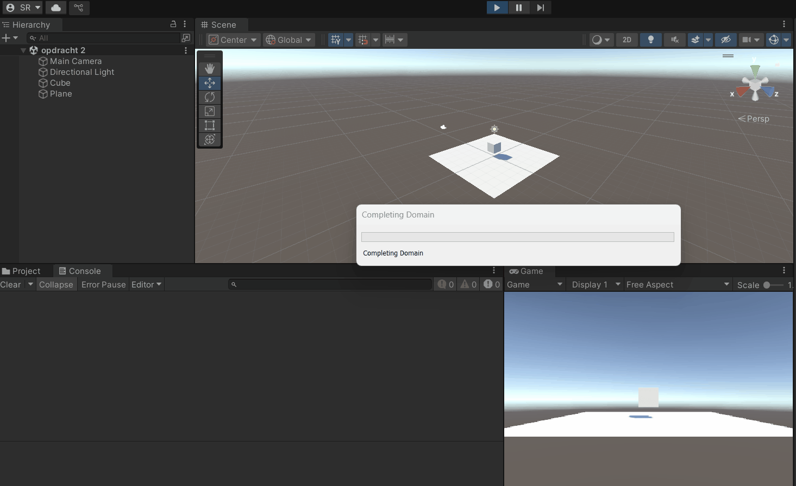
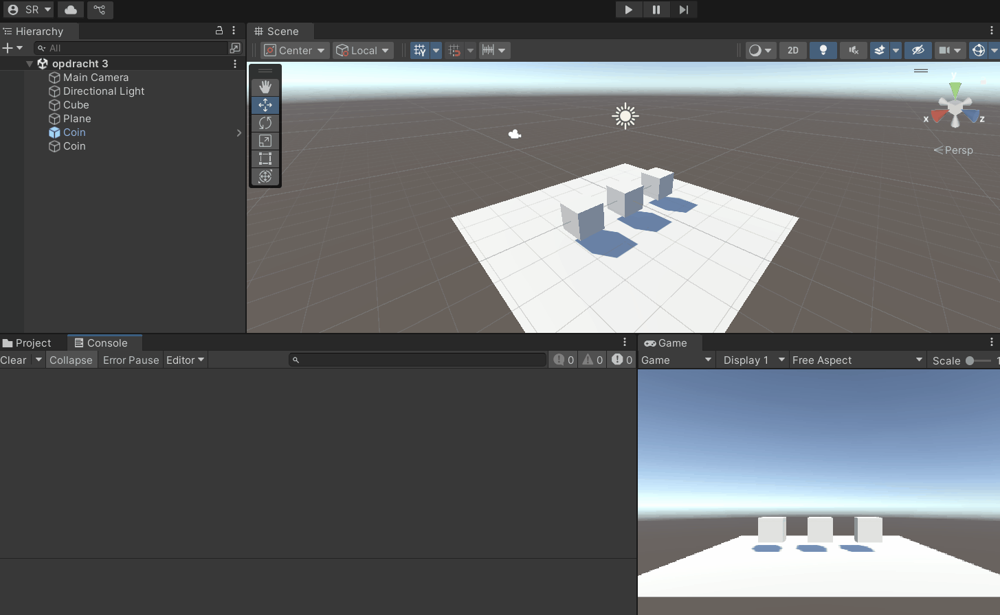
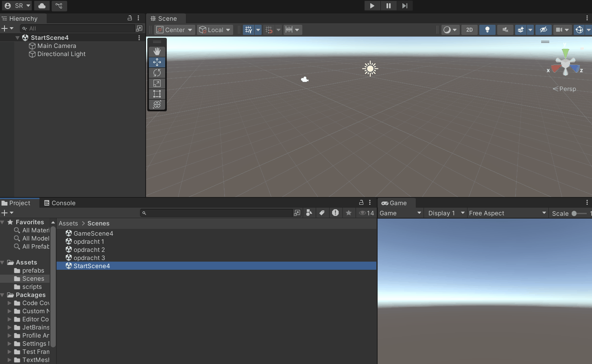
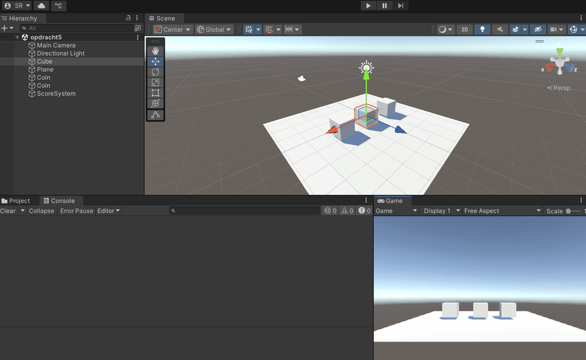

# Score en Munten

beginner code aangepast zodat het werkt. 3 begin berichten, als je op spatie drukt tellen er 10 munten bij, bij 50 munten heb je gewonnen.

[code](m4prog/Assets/scripts/PlayerScore.cs)

# Bewegende Speler

gevordende code gebruikt en naar mijn eigen code van vorige dingen gekeken om het te maken.

[code](m4prog/Assets/scripts/PlayerControl.cs)

# Timed Muntjacht

beginner code aangepast zodat je kan bewegen en coins op kan pakken ik 20 seconden tijd, coins tellen bij een score op en verdwijnen nadat ze opgepakt zijn

[code](m4prog/Assets/scripts/GameManager.cs)

# Start en Spel

van beginner code afgegaan waardoor je van scene wisselt als je op spatie drukt naar een scene met een coin prefab

[code](m4prog/Assets/scripts/SceneSwitcher.cs)\
[code](m4prog/Assets/scripts/PlayerControl2.cs)

# Gestructureerde Muntjager

beginner code aangepast

[code](m4prog/Assets/scripts/PlayerMove.cs)
[code](m4prog/Assets/scripts/ScoreManager.cs)